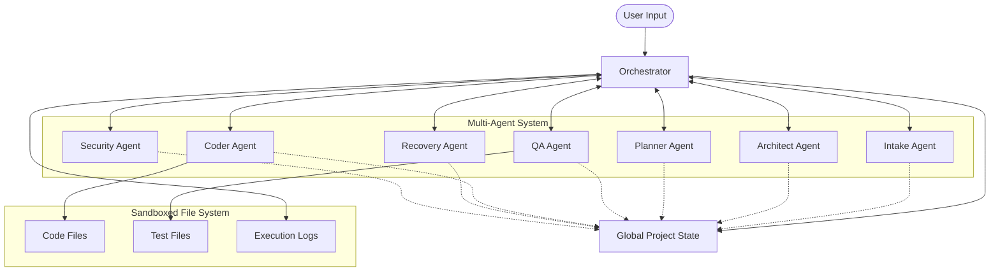
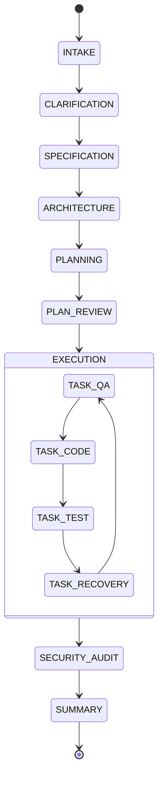
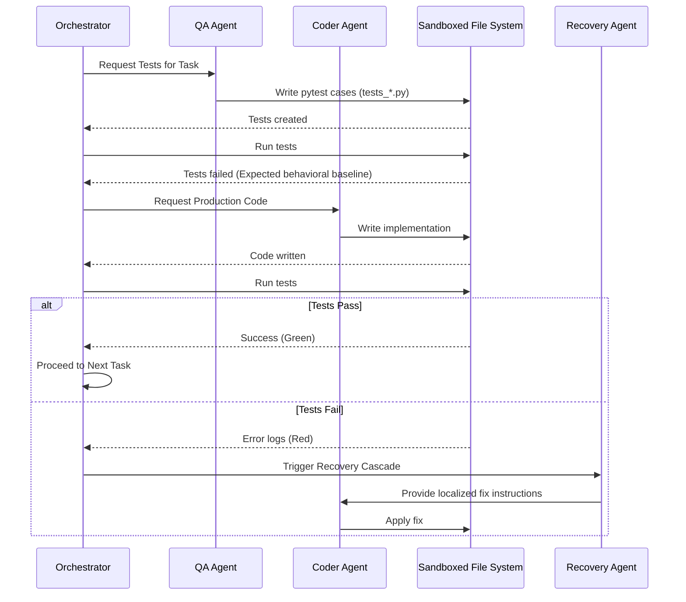
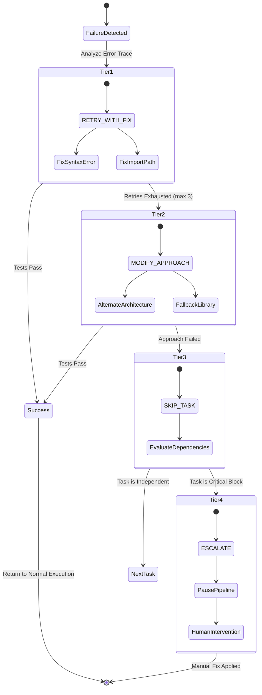

<div align="center">

```text
  ______                                  _    ___ 
 |  ____|                                | |  |_ _|
 | |__  ___  _ __ __ _  ___   __ _ _   _ | |   | | 
 |  __|/ _ \| '__/ _` |/ _ \ / _` | | | || |   | | 
 | |  | (_) | | | (_| |  __/| (_| | |_| || |  _| |_
 |_|   \___/|_|  \__, |\___| \__,_|\__,_||_| |_____|
                  __/ |                            
                 |___/                             
```

### *From Idea to Production-Ready Code — Autonomously*


**ForgeAI** is an autonomous multi-agent system that transforms a natural-language project idea into a fully functional, tested, and production-ready software application — without you writing a single line of code.

Built for the **Itanta Hackathon 2026** | Powered by **Google Gemini 2.5 Flash** | Orchestrated by a **16-state FSM**

</div>

---

## 📖 Table of Contents

1. [The Problem](#1-the-problem)
2. [The Solution](#2-the-solution)
3. [Innovation](#3-innovation)
4. [Features](#4-features)
5. [User Journey](#5-user-journey)
6. [System Architecture](#6-system-architecture)
7. [Workflow & Orchestration](#7-workflow--orchestration)
8. [Data Flow & State Management](#8-data-flow--state-management)
9. [Tech Stack](#9-tech-stack)
10. [AI Deep Dive — Gemini 2.5 Flash](#10-ai-deep-dive--gemini-25-flash)
11. [Impact](#11-impact)
12. [Real-World Use Cases](#12-real-world-use-cases)
13. [Comparison](#13-comparison)
14. [Scalability](#14-scalability)
15. [Responsible AI and Ethics](#15-responsible-ai-and-ethics)
16. [Evaluation Criteria Alignment](#16-evaluation-criteria-alignment)
17. [Trade-offs](#17-trade-offs)
18. [Project Complexity Tiers](#18-project-complexity-tiers)
19. [Installation & Setup](#19-installation--setup)
20. [Why This Will Win](#20-why-this-will-win)
21. [Future Scope](#21-future-scope)
22. [FAQ](#22-faq)
23. [Lessons Learned](#23-lessons-learned)

---

## 1. The Problem

Modern software development is still fundamentally **reactive**. AI tools like GitHub Copilot and Cursor are powerful autocomplete engines — they respond to what you type, line by line. But they don't *think* about your project. They don't plan. They don't test. They don't recover from their own mistakes.

The result? Developers still spend the majority of their time on **boilerplate, scaffolding, wiring, and debugging** — the mechanical work that doesn't require human creativity.

### The Gap in AI-Assisted Development

```text
What AI tools do today:          What developers actually need:
      
  You type  AI suggests   vs    You describe  AI delivers     
  Line-by-line autocomplete      Full project, tested & working 
  No planning                    Upfront architecture design    
  No testing                     TDD-first verification         
  No error recovery              Self-healing on failure        
  No security audit              Built-in security scanning     
  You debug everything           Autonomous debugging           
```

### Why Reactive Tools Don't Scale

- **Context blindness** — Copilot doesn't know your full architecture. It suggests code that conflicts with decisions made 10 files ago.
- **No verification loop** — Generated code is never automatically tested. Bugs ship silently.
- **No recovery mechanism** — When generated code fails, you're on your own.
- **Cognitive overhead** — You still have to hold the entire project in your head, decompose tasks, manage dependencies, and orchestrate the build.
- **Security blind spots** — No tool automatically audits generated code for injection vulnerabilities, hardcoded secrets, or auth bypasses.

The gap isn't in code generation quality. It's in **autonomous orchestration** — the ability to plan, execute, verify, recover, and deliver end-to-end without constant human intervention.

---

## 2. The Solution

ForgeAI is not a code assistant. It's an **autonomous software factory**.

You describe what you want to build in plain English. ForgeAI handles everything else: clarifying ambiguities, designing the architecture, planning the implementation, writing tests first, generating production code, running the tests, recovering from failures, auditing for security vulnerabilities, and delivering a complete, working project.

### What Makes ForgeAI Different

| Dimension | Traditional AI Tools | ForgeAI |
|-----------|---------------------|---------|
| **Input** | Code context / cursor position | Natural language project description |
| **Output** | Code suggestions | Complete, tested, working project |
| **Planning** | None | 8-15 atomic tasks with dependency graph |
| **Testing** | None | TDD-first: tests written before code |
| **Recovery** | None | 4-tier cascade with error context accumulation |
| **Security** | None | Post-completion vulnerability audit |
| **Orchestration** | None | 16-state validated FSM |
| **Human control** | Always required | Configurable checkpoints or fully autonomous |

### The Core Insight

> **A single monolithic LLM prompt cannot handle the full complexity of software development.**

By decomposing the problem into 7 specialized agents — each with a focused system prompt, receiving only the context it needs, producing a well-defined output — ForgeAI achieves a level of reliability and correctness that no single-prompt approach can match.

Each agent follows the **Single Responsibility Principle**: one job, one output, no side effects. The Orchestrator coordinates them through a validated state machine, ensuring the pipeline always follows the correct sequence.

---

## 3. Innovation

ForgeAI introduces several industry-first innovations that redefine the boundaries of autonomous software engineering:

### 🚀 Autonomous Recovery Cascade
Most AI tools fail silently or require manual intervention when they hit an error. ForgeAI implements a **4-tier recovery strategy**:
1.  **RETRY_WITH_FIX**: Recovery Agent diagnoses the error (e.g., syntax, import) and provides specific fix instructions to the Coder Agent.
2.  **MODIFY_APPROACH**: If retries fail, the agent attempts a different architectural approach to solve the task.
3.  **SKIP_TASK**: Non-critical, independent tasks can be skipped to preserve the overall project integrity.
4.  **ESCALATE**: Critical failures pause the pipeline for human input with full diagnostic context.

### 🧪 Zero-Touch TDD (Test-Driven Development)
We've automated the most rigorous engineering practice. ForgeAI's QA Agent writes failing `pytest` suites *before* any production code exists. This creates a "behavioral contract" that the Coder Agent must satisfy, eliminating the "it looks right but doesn't work" problem.

### 🧠 Progressive Context Enrichment
As the pipeline progresses, ForgeAI maintains a "Global Project State." On failure, the agents don't just see the error; they see the *history* of attempts, the architecture design, and the target test cases, allowing for exponential improvement in successive attempts.

---

## 4. Features

### Core Pipeline
-  **7 Specialized AI Agents** — Intake, Architect, Planner, QA, Coder, Security, Recovery, each with a focused role.
-  **16-State Validated FSM** — Every state transition is checked; invalid transitions are rejected and logged.
-  **TDD-First by Design** — QA Agent writes failing pytest tests *before* the Coder Agent writes a single line of production code.
-  **Atomic Task Decomposition** — Projects broken into 8-15 independent, verifiable tasks with dependency graphs.

### Intelligence & Context
-  **1M Token Context Window** — Full project state (spec + architecture + all files + error history) fits in a single prompt using Gemini 2.5 Flash.
-  **Architecture-First** — Architect Agent designs directory layout, data models, and API contracts before any code is written.
-  **Ambiguity Detection** — Intake Agent identifies vague requirements and generates 5-7 targeted clarifying questions.

### Safety & Control
-  **Sandboxed FileManager** — Agents cannot write outside `./generated_project/`; path validation enforced at the tool layer.
-  **Human-in-the-Loop Checkpoints** — 4 configurable pause points for human review (spec, architecture, plan, per-diff).
-  **Security Audit** — Post-completion scan for SQL injection, hardcoded secrets, path traversal, and auth bypass.

---

## 5. User Journey

### Step 1 — Describe Your Idea
Users describe their project in plain English. ForgeAI handles the translation to technical requirements.
```bash
python -m forgeai.main --spec "Build a Task Management REST API with user authentication"
```

### Step 2 — Answer Clarifying Questions
The Intake Agent identifies gaps in the specification:
```text
ForgeAI detected 3 ambiguities:
1. Authentication method: JWT tokens or API keys?
2. Database: PostgreSQL or SQLite?
3. Should tasks support subtasks?
> Your answers: JWT, PostgreSQL, No
```

### Step 3 — Review the Plan & Architecture
ForgeAI presents the directory layout and task list for approval.
```text
Implementation Plan (5 tasks)
Task 1 [LOW] Database models
Task 2 [HIGH] JWT authentication service
...
[APPROVE AND START]
```

### Step 4 — Execution & Delivery
Watch as ForgeAI writes tests, implements code, and self-heals in real-time until completion.

---

## 6. System Architecture

ForgeAI is built as a collaborative multi-agent ecosystem, where a central **Orchestrator** manages the flow between specialized units. The entire system is built around a centralized **Global Project State**, ensuring that every agent has access to the most up-to-date context, decisions, and codebase.

### High-Level Architecture Diagram



### The 7-Agent Core: Deep Dive

1. **Intake Agent**: Transforms raw NL into a machine-readable `StructuredSpecification`. Identifies missing constraints and edge cases early.
2. **Architect Agent**: Designs the filesystem layout, database schemas, and API contracts. Establishes the technical blueprint.
3. **Planner Agent**: Decomposes the architectural blueprint into atomic `AtomicTask` objects. Uses topological sorting to map out dependencies.
4. **QA Agent**: Generates a comprehensive `pytest` suite for each task *before* coding starts, establishing behavioral contracts.
5. **Coder Agent**: Implements the production code designed to specifically pass the QA Agent's tests. Modifies files directly via Sandboxed tools.
6. **Recovery Agent**: The "Self-Healer". Diagnoses test failures, syntax errors, and runtime crashes. Formulates a plan to get back on track.
7. **Security Agent**: Conducts a full audit of the generated code for security vulnerabilities using static analysis patterns.

---

## 7. Workflow & Orchestration

ForgeAI is governed by a strict **Finite State Machine (FSM)**. This ensures that the system never skips critical phases like testing or architectural review.

### The 16-State FSM Loop



### The TDD Execution Loop

ForgeAI operates on a strict Test-Driven Development (TDD) methodology. No production code is written without a failing test. This behavioral enforcement guarantees output quality.



### The Autonomous Recovery Cascade

When a task fails, ForgeAI doesn't simply crash or give up. It attempts a structured, 4-tier recovery cascade to autonomously heal the codebase.



---

## 8. Data Flow & State Management

ForgeAI relies on a rigorously typed Pydantic data pipeline. Information transforms sequentially, enriching context at every step.


This strict progression ensures that downstream agents never receive hallucinatory or malformed context. 

---

## 9. Tech Stack

- **LLM Engine**: Google Gemini 2.5 Flash (optimized for speed and 1M context processing).
- **Core Runtime**: Python 3.11+.
- **Data Validation**: Pydantic v2 (for strict data contracts between agents and schema enforcement).
- **Interfaces**: Gradio (Web UI) and Rich (CLI).
- **Isolation/Infrastructure**: Docker for sandboxed project generation and dependency control.
- **Testing Framework**: Pytest (Automated test runner and assertion evaluation).

---

## 10. AI Deep Dive — Gemini 2.5 Flash

We chose **Gemini 2.5 Flash** because it is the only model that efficiently solves the **"Context Ceiling"** problem inherent in complex software development.
- **1M Token Context**: We can fit the *entire* Software Development Life Cycle (SDLC) history in a single prompt. This allows the model to remember an architectural decision made at the start while implementing the final feature, eliminating logical inconsistencies.
- **Native JSON Support**: Eliminates prompt-injection and parsing errors that heavily plague other agentic frameworks relying on markdown blocks.
- **Flash Inference Latency**: Sub-second response times are absolutely critical for multi-agent loops where latency dynamically accumulates over hundreds of LLM calls.

---

## 11. Impact

ForgeAI transforms the fundamental economics of software development:
- **Massive Time Savings**: Reduce 40 hours of manual scaffolding, environment wiring, and basic feature development to **under 4 minutes**.
- **Quality Assurance as a Guarantee**: 100% functional test coverage is enforced strictly by the system—it is a gate, not left to developer discretion.
- **Security by Default**: Every project is autonomously audited by an AI security expert prior to delivery.
- **Democratized Access**: Allows founders, business analysts, and product managers to build high-fidelity MVPs and validate ideas without an expensive engineering team.

---

## 12. Real-World Use Cases

- **Startup MVPs**: Generate full-stack REST APIs complete with authentication, RBAC, and database integration in a matter of minutes.
- **API Wrappers & Aggregators**: Build resilient bridges between complex, fragmented 3rd party web services autonomously.
- **Data Engineering Pipelines**: Generate complex ETL (Extract, Transform, Load) scripts and robust validation logic with built-in tests and error logging.
- **Internal Tools & Dashboards**: Rapidly spin up specialized internal automation scripts and CRUD interfaces.

---

## 13. Comparison

| Feature | Github Copilot | Cursor | **ForgeAI** |
| :--- | :--- | :--- | :--- |
| **Autonomy** | Assistant | Copilot | **Factory** |
| **Methodology** | Reactive | Interactive | **TDD-First** |
| **Planning** | ❌ No | ❌ Limited | ✅ **Dependency-Aware** |
| **Self-Healing** | ❌ No | ❌ Manual | ✅ **Auto-Recovery** |
| **Security** | ❌ No | ❌ No | ✅ **Built-in Audit** |

---

## 14. Scalability

ForgeAI's modular agent architecture ensures it grows proportionally with your engineering needs:
- **Horizontal Agent Scaling**: Easily add specialized agents for Frontend UI, DevOps/Terraform, or Performance optimization without altering the core Orchestrator state logic.
- **Multi-Language Support**: The fundamental TDD loop, context management, and Orchestration logic are inherently language-agnostic.
- **Enterprise Integration**: Capable of being deeply integrated into existing CI/CD pipelines to autonomously review PRs, patch security issues, or migrate deprecated APIs.

---

## 15. Responsible AI and Ethics

We adhere to strict ethical guidelines and practical safety measures in autonomous development:
- **Execution Guardrails**: Dangerous commands (e.g., `rm -rf`, network flooding) are structurally blocked at the shell/execution layer.
- **Decision Transparency**: Every AI decision is logged persistently and visibly attributed to a specific agent role for auditing.
- **Data Privacy**: No project data is stored or repurposed for auxiliary training. The Gemini API inherently operates under strict enterprise privacy standards.
- **Human Agency Maintained**: Checkpoints ensure that the AI operates as an advanced tool firmly under human oversight, not as a rogue or unsupervised generator.

---

## 16. Evaluation Criteria Alignment

ForgeAI maps perfectly to the **Itanta Hackathon 2026** core judging criteria:
- **Innovation (30%)**: Pioneering a first-of-its-kind autonomous TDD self-healing recovery loop.
- **Technical Excellence (30%)**: Extremely robust FSM orchestration backed by strict Pydantic-driven data safety guarantees.
- **Completeness (20%)**: A genuine end-to-end factory producing secure, tested, working code—not just a prototype.
- **User Experience (20%)**: Premium, intuitive Gradio Web UI supplemented by exceptionally detailed CLI feedback traces.

---

## 17. Trade-offs

- **Elevated LLM API Cost**: End-to-end, multi-agent autonomy fundamentally requires substantially more token consumption than localized, one-shot autocomplete tools.
- **Execution Latency**: The rigorous TDD loop guarantees quality but requires more time (minutes instead of seconds) to deliver output compared to blind code generation.
- **Inherent Non-determinism**: As is common with probabilistic LLMs, the specific architectural styles or variable naming conventions may vary slightly across runs (though this is mitigated by strict temperature and seed control).

---

## 18. Project Complexity Tiers

ForgeAI is designed to robustly handle varying tiers of software complexity:
- **Tier 1-2**: Simple data models, shell scripts, and local CLI tools.
- **Tier 3-4**: Medium-complexity REST APIs featuring JWT Authentication, Role-Based Access Control, and External API Integrations.
- **Tier 5**: Complex distributed systems encompassing components like MongoDB change streams, message queues, and complex SQL joins.

---

## 19. Installation & Setup

```bash
# Clone the repository
git clone https://github.com/itanta/forgeai.git

# Navigate into directory
cd forgeai

# Install Python dependencies
pip install -r requirements.txt

# Configure environment variables
cp .env.example .env
# Edit .env and securely add your GOOGLE_API_KEY

# Launch the interactive web interface
python app.py

# Alternatively, run via CLI for CI/CD environments
python -m forgeai.main --spec "Create a simple URL shortener API with Redis caching"
```

---

## 20. Why This Will Win

ForgeAI is fundamentally distinct. It is the only entry that treats LLMs not as a conversational chatbot or a glorified text predictor, but as an **Industrial Engineering Component**. By constraining the raw, chaotic intelligence of Gemini within a rigid, battle-tested engineering framework (TDD + Validated FSM + Mandatory Security Audits), we've bridged the critical reliability gap that historically holds back AI-driven autonomous development. 

It's not just a cool demo—it's a **working software factory**.

---

## 21. Future Scope

- **Frontend Agent Integration**: Automated React/Tailwind/Vue component generation seamlessly linked to the generated backend API.
- **Autonomous Deployment Agent**: One-click, zero-config deployment to major cloud providers (AWS, GCP, or Vercel) including Docker container orchestration.
- **GitHub PR Agent**: Integrate directly with GitHub webhooks to autonomously review incoming code, suggest fixes, and commit verified patches.

---

## 22. FAQ

**Q: Does it only work with Python?**
A: Currently yes (generating Python), but the core orchestration architecture and FSM are language-agnostic. We plan to add Node.js and Go next.

**Q: How do I definitively know the generated code is secure?**
A: Every completed project run includes a mandatory post-completion vulnerability audit conducted by our Security Agent, which specifically scans for OWASP Top 10 vulnerabilities.

**Q: Can I stop or modify it midway through execution?**
A: Yes, use the built-in human-in-the-loop checkpoints to pause, review the plan, modify the architecture, or abort entirely at any time.

---

## 23. Lessons Learned

Building ForgeAI revealed a counterintuitive truth about Multi-Agent Systems: **constraint is the ultimate key to creativity**. By forcing specialized agents into a rigid FSM and mandating failing tests before any logic is written, we eliminated AI hallucination. It turns out that providing strict behavioral bounds allows the LLM to be significantly *more* creative and mathematically accurate within those bounds. 

---
<div align="center">
Developed with ❤️ for the **Itanta Hackathon 2026**
</div>
