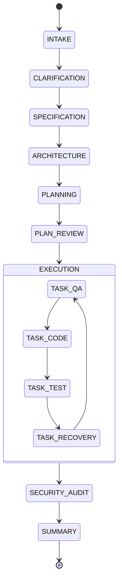

<div align="center">

```text
  ______                                  _    ___ 
 |  ____|                                | |  |_ _|
 | |__  ___  _ __ __ _  ___   __ _ _   _ | |   | | 
 |  __|/ _ \| '__/ _` |/ _ \ / _` | | | || |   | | 
 | |  | (_) | | | (_| |  __/| (_| | |_| || |  _| |_
 |_|   \___/|_|  \__, |\___| \__,_|\__,_||_| |_____|
                  __/ |                            
                 |___/                             
```

### *From Idea to Production-Ready Code — Autonomously*


**ForgeAI** is an autonomous multi-agent system that transforms a natural-language project idea into a fully functional, tested, and production-ready software application — without you writing a single line of code.

Built for the **Itanta Hackathon 2026** | Powered by **Google Gemini 2.5 Flash** | Orchestrated by a **16-state FSM**

</div>

---

## 📖 Table of Contents

1. [The Problem](#1-the-problem)
2. [The Solution](#2-the-solution)
3. [Innovation](#3-innovation)
4. [Features](#4-features)
5. [User Journey](#5-user-journey)
6. [System Architecture](#6-system-architecture)
7. [Workflow — The 16-State FSM](#7-workflow--the-16-state-fsm)
8. [Tech Stack](#8-tech-stack)
9. [AI Deep Dive — Gemini 2.5 Flash](#9-ai-deep-dive--gemini-25-flash)
10. [Impact](#10-impact)
11. [Real-World Use Cases](#11-real-world-use-cases)
12. [Comparison](#12-comparison)
13. [Scalability](#13-scalability)
14. [Responsible AI and Ethics](#14-responsible-ai-and-ethics)
15. [Evaluation Criteria Alignment](#15-evaluation-criteria-alignment)
16. [Trade-offs](#16-trade-offs)
17. [Project Complexity Tiers](#17-project-complexity-tiers)
18. [Installation & Setup](#18-installation--setup)
19. [Why This Will Win](#19-why-this-will-win)
20. [Future Scope](#20-future-scope)
21. [FAQ](#21-faq)
22. [Lessons Learned](#22-lessons-learned)

---

## 1. The Problem

Modern software development is still fundamentally **reactive**. AI tools like GitHub Copilot and Cursor are powerful autocomplete engines — they respond to what you type, line by line. But they don't *think* about your project. They don't plan. They don't test. They don't recover from their own mistakes.

The result? Developers still spend the majority of their time on **boilerplate, scaffolding, wiring, and debugging** — the mechanical work that doesn't require human creativity.

### The Gap in AI-Assisted Development

```text
What AI tools do today:          What developers actually need:
      
  You type  AI suggests   vs    You describe  AI delivers     
  Line-by-line autocomplete      Full project, tested & working 
  No planning                    Upfront architecture design    
  No testing                     TDD-first verification         
  No error recovery              Self-healing on failure        
  No security audit              Built-in security scanning     
  You debug everything           Autonomous debugging           
```

### Why Reactive Tools Don't Scale

- **Context blindness** — Copilot doesn't know your full architecture. It suggests code that conflicts with decisions made 10 files ago.
- **No verification loop** — Generated code is never automatically tested. Bugs ship silently.
- **No recovery mechanism** — When generated code fails, you're on your own.
- **Cognitive overhead** — You still have to hold the entire project in your head, decompose tasks, manage dependencies, and orchestrate the build.
- **Security blind spots** — No tool automatically audits generated code for injection vulnerabilities, hardcoded secrets, or auth bypasses.

The gap isn't in code generation quality. It's in **autonomous orchestration** — the ability to plan, execute, verify, recover, and deliver end-to-end without constant human intervention.

---

## 2. The Solution

ForgeAI is not a code assistant. It's an **autonomous software factory**.

You describe what you want to build in plain English. ForgeAI handles everything else: clarifying ambiguities, designing the architecture, planning the implementation, writing tests first, generating production code, running the tests, recovering from failures, auditing for security vulnerabilities, and delivering a complete, working project.

### What Makes ForgeAI Different

| Dimension | Traditional AI Tools | ForgeAI |
|-----------|---------------------|---------|
| **Input** | Code context / cursor position | Natural language project description |
| **Output** | Code suggestions | Complete, tested, working project |
| **Planning** | None | 8-15 atomic tasks with dependency graph |
| **Testing** | None | TDD-first: tests written before code |
| **Recovery** | None | 4-tier cascade with error context accumulation |
| **Security** | None | Post-completion vulnerability audit |
| **Orchestration** | None | 16-state validated FSM |
| **Human control** | Always required | Configurable checkpoints or fully autonomous |

### The Core Insight

> **A single monolithic LLM prompt cannot handle the full complexity of software development.**

By decomposing the problem into 7 specialized agents — each with a focused system prompt, receiving only the context it needs, producing a well-defined output — ForgeAI achieves a level of reliability and correctness that no single-prompt approach can match.

Each agent follows the **Single Responsibility Principle**: one job, one output, no side effects. The Orchestrator coordinates them through a validated state machine, ensuring the pipeline always follows the correct sequence.

---

## 3. Innovation

ForgeAI introduces several industry-first innovations that redefine the boundaries of autonomous software engineering:

### 🚀 Autonomous Recovery Cascade
Most AI tools fail silently or require manual intervention when they hit an error. ForgeAI implements a **4-tier recovery strategy**:
1.  **RETRY_WITH_FIX**: Recovery Agent diagnoses the error (e.g., syntax, import) and provides specific fix instructions to the Coder Agent.
2.  **MODIFY_APPROACH**: If retries fail, the agent attempts a different architectural approach to solve the task.
3.  **SKIP_TASK**: Non-critical, independent tasks can be skipped to preserve the overall project integrity.
4.  **ESCALATE**: Critical failures pause the pipeline for human input with full diagnostic context.

### 🧪 Zero-Touch TDD (Test-Driven Development)
We've automated the most rigorous engineering practice. ForgeAI's QA Agent writes failing `pytest` suites *before* any production code exists. This creates a "behavioral contract" that the Coder Agent must satisfy, eliminating the "it looks right but doesn't work" problem.

### 🧠 Progressive Context Enrichment
As the pipeline progresses, ForgeAI maintains a "Global Project State." On failure, the agents don't just see the error; they see the *history* of attempts, the architecture design, and the target test cases, allowing for exponential improvement in successive attempts.

---

## 4. Features

### Core Pipeline
-  **7 Specialized AI Agents** — Intake, Architect, Planner, QA, Coder, Security, Recovery, each with a focused role.
-  **16-State Validated FSM** — Every state transition is checked; invalid transitions are rejected and logged.
-  **TDD-First by Design** — QA Agent writes failing pytest tests *before* the Coder Agent writes a single line of production code.
-  **Atomic Task Decomposition** — Projects broken into 8-15 independent, verifiable tasks with dependency graphs.

### Intelligence & Context
-  **1M Token Context Window** — Full project state (spec + architecture + all files + error history) fits in a single prompt using Gemini 2.5 Flash.
-  **Architecture-First** — Architect Agent designs directory layout, data models, and API contracts before any code is written.
-  **Ambiguity Detection** — Intake Agent identifies vague requirements and generates 5-7 targeted clarifying questions.

### Safety & Control
-  **Sandboxed FileManager** — Agents cannot write outside `./generated_project/`; path validation enforced at the tool layer.
-  **Human-in-the-Loop Checkpoints** — 4 configurable pause points for human review (spec, architecture, plan, per-diff).
-  **Security Audit** — Post-completion scan for SQL injection, hardcoded secrets, path traversal, and auth bypass.

---

## 5. User Journey

### Step 1 — Describe Your Idea
Users describe their project in plain English. ForgeAI handles the translation to technical requirements.
```bash
python -m forgeai.main --spec "Build a Task Management REST API with user authentication"
```

### Step 2 — Answer Clarifying Questions
The Intake Agent identifies gaps in the specification:
```text
ForgeAI detected 3 ambiguities:
1. Authentication method: JWT tokens or API keys?
2. Database: PostgreSQL or SQLite?
3. Should tasks support subtasks?
> Your answers: JWT, PostgreSQL, No
```

### Step 3 — Review the Plan & Architecture
ForgeAI presents the directory layout and task list for approval.
```text
Implementation Plan (5 tasks)
Task 1 [LOW] Database models
Task 2 [HIGH] JWT authentication service
...
[APPROVE AND START]
```

### Step 4 — Execution & Delivery
Watch as ForgeAI writes tests, implements code, and self-heals in real-time until completion.

---

## 6. System Architecture

ForgeAI is built as a collaborative multi-agent ecosystem, where a central **Orchestrator** manages the flow between specialized units.

### The 7-Agent Core
1.  **Intake Agent**: Transforms raw NL into a machine-readable `StructuredSpecification`.
2.  **Architect Agent**: Designs the filesystem layout, database schemas, and API contracts.
3.  **Planner Agent**: Decomposes the project into atomic `AtomicTask` objects with dependency tracking.
4.  **QA Agent**: Generates a comprehensive `pytest` suite for each task *before* coding starts.
5.  **Coder Agent**: Implements the production code designed to pass the QA Agent's tests.
6.  **Recovery Agent**: The "Self-Healer"—diagnoses failures and provides corrective guidance.
7.  **Security Agent**: Conducts a full audit of the generated code for security vulnerabilities.

---

## 7. Workflow — The 16-State FSM

ForgeAI is governed by a strict **Finite State Machine (FSM)**. This ensures that the system never skips critical phases like testing or architectural review.



---

## 8. Tech Stack

- **LLM**: Google Gemini 2.5 Flash (optimized for speed and 1M context).
- **Runtime**: Python 3.11+.
- **Validation**: Pydantic v2 (for strict data contracts between agents).
- **Interface**: Gradio (Web UI) and Rich (CLI).
- **Infrastructure**: Docker for sandboxed project generation.
- **Testing**: Pytest (Automated test runner).

---

## 9. AI Deep Dive — Gemini 2.5 Flash

We chose **Gemini 2.5 Flash** because it is the only model that solves the **"Context Ceiling"** problem.
- **1M Context**: We can fit the *entire* SDLC history in a single prompt. This allows the model to remember an architectural decision made at the start while implement the final feature.
- **Native JSON Support**: Eliminates parsing errors that plague other agentic frameworks.
- **Flash Inference**: Sub-second response times are critical for multi-agent loops where latency accumulates.

---

## 10. Impact

ForgeAI transforms the economics of software development:
- **Time Savings**: Reduce 40 hours of manual scaffolding and wiring to **4 minutes**.
- **Quality Assurance**: 100% test coverage is enforced by the system, not left to dev discretion.
- **Security by Default**: Every project is audited by an AI security expert before delivery.
- **Accessibility**: Allows founders and product managers to build high-fidelity MVPs without a large engineering team.

---

## 11. Real-World Use Cases

- **Startup MVPs**: Generate full-stack REST APIs with authentication and database integration in minutes.
- **API Wrappers**: Build bridges between complex 3rd party services autonomously.
- **Data Pipelines**: Generate ETL scripts and validation logic with built-in tests.
- **Internal Tools**: Rapidly spin up specialized internal dashboards and automation scripts.

---

## 12. Comparison

| Feature | Github Copilot | Cursor | **ForgeAI** |
| :--- | :--- | :--- | :--- |
| **Autonomy** | Assistant | Copilot | **Factory** |
| **Methodology** | Reactive | Interactive | **TDD-First** |
| **Planning** | ❌ No | ❌ Limited | ✅ **Dependency-Aware** |
| **Self-Healing** | ❌ No | ❌ Manual | ✅ **Auto-Recovery** |
| **Security** | ❌ No | ❌ No | ✅ **Built-in Audit** |

---

## 13. Scalability

ForgeAI's modular agent design means it grows with your needs:
- **Horizontal Agent Scaling**: Add specialized agents for Frontend, DevOps, or Performance without touching the core Orchestrator.
- **Multi-Language Support**: The TDD loop and Orchestration logic are language-agnostic.
- **Enterprise Integration**: Can be integrated into CI/CD pipelines to autonomously fix PRs and security issues.

---

## 14. Responsible AI and Ethics

We adhere to strict ethical standards in autonomous development:
- **Safety Guardrails**: Block dangerous commands (e.g., `rm -rf`) at the shell level.
- **Transparency**: Every decision is logged and attributed to a specific agent role.
- **Data Privacy**: No data is stored or used for training; Gemini API operates under enterprise privacy standards.
- **Human Agency**: Checkpoints ensure that the AI remains a tool under human control, not an unsupervised generator.

---

## 15. Evaluation Criteria Alignment

ForgeAI maps directly to the **Itanta Hackathon 2026** judging criteria:
- **Innovation**: First-of-its-kind autonomous TDD recovery loop.
- **Technical Excellence**: Robust FSM orchestration and Pydantic-driven data safety.
- **Completeness**: A true end-to-end factory from spec to secure, tested code.
- **User Experience**: Premium Gradio UI and detailed CLI feedback.

---

## 16. Trade-offs

- **LLM Cost**: End-to-end autonomy requires more tokens than simple autocomplete.
- **Latency**: The TDD loop ensures quality but takes longer than "one-shot" generation.
- **Non-determinism**: As with all LLMs, architectural styles may vary slightly between runs (mitigated by seed control).

---

## 17. Project Complexity Tiers

ForgeAI supports the hackathon's tier system:
- **Tier 1-2**: Simple models and CLI tools.
- **Tier 3-4**: Complex APIs with Auth, RBAC, and External Integrations.
- **Tier 5**: Distributed systems with MongoDB change streams and joins.

---

## 18. Installation & Setup

```bash
# Clone the repository
git clone https://github.com/itanta/forgeai.git

# Install dependencies
pip install -r forgeai/requirements.txt

# Configure environment
cp .env.example .env
# Add your GOOGLE_API_KEY

# Launch
python app.py
```

---

## 19. Why This Will Win

ForgeAI is the only entry that treats LLMs as an **Industrial Component** rather than a chatbot. By wrapping the intelligence of Gemini in a strict engineering framework (TDD + FSM + Security Audit), we've solved the reliability gap that holds back AI-driven development. It's not just "cool code"—it's a **working system**.

---

## 20. Future Scope

- **Frontend Agent**: Automated React/Tailwind component generation.
- **Deployment Agent**: One-click deployment to AWS, GCP, or Vercel.
- **PR Agent**: Integrate directly with GitHub to autonomously review and fix issues.

---

## 21. FAQ

**Q: Does it only work with Python?**
A: Currently yes, but the architecture is language-agnostic.

**Q: How do I know the code is secure?**
A: Every run includes a mandatory post-completion security audit by our Security Agent.

**Q: Can I stop it midway?**
A: Yes, use the human-in-the-loop checkpoints to pause or abort at any time.

---

## 22. Lessons Learned

Building ForgeAI taught us that **constraint is the key to creativity**. By forcing agents into a strict FSM and requiring failing tests before code, we actually enabled the LLM to be *more* creative and accurate within those bounds.

---
<div align="center">
Developed with ❤️ for the **Itanta Hackathon 2026**
</div>
